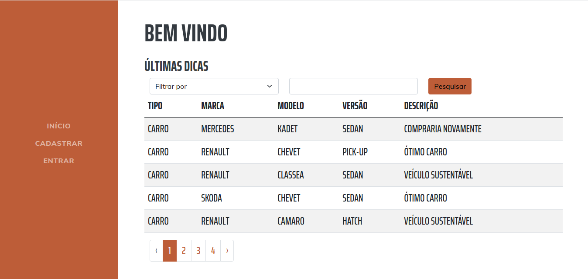

<h1><b>Dicas Auto</b></h1>

## O projeto

 O projeto Dicas Auto foi idealizado através de um desafio, onde deveria construir uma pagina web onde os usuários possam fazer o cadastro/login e inserir dicas específicas dos veículos por tipo (Moto, Carro, Caminhão), incluir marca, modelo e versão. A versão do veículo sendo opcional, por existir dica genérica do modelo. 

 

O projeto foi desenvolvido utilizando Bootstrap com layout free, para o Front-End, no Back-End foi utilizado o Framework Laravel com a linguagem PHP.

A seguir poderá visualizar dois métodos de instalação do projeto, o primeiro através de containers Docker, em seguida executando a aplicação sem utilizar os containers com a engine própria do Artisan Laravel. 

 

# Baixando o projeto

Você poderá baixar o projeto completo executando o seguinte comando em seu terminal.

<pre>git clone https://github.com/RuanSalles/desafio-dicas-auto.git </pre>

 

# Buildando o projeto

## Ambiente Local

### 1. Requisitos mínimos

* PHP versão 7.4+
* Composer 2.1+
* Mysql 8.0+

### 2. Compilando o projeto

 Tendo composer instalado, navegue até a raiz do projeto e execute o comando a seguir: 
<pre>composer install</pre>

Verifique a saída do download das dependências do sistema estando tudo correto, ao final do download siga para o passo a seguir.

### Configurando o projeto

Vá até o arquivo <b> .env</b> contido na raiz do projeto, e altere as variáveis relacionadas ao banco de dados.

* Instalando com MySQL
<pre>
DB_CONNECTION=mysql
DB_HOST=db (localhost ou 127.0.0.1)
DB_PORT=3306 (porta padrão)
DB_DATABASE=meuprojeto-db (nome do banco de dados a sua escolha)
DB_USERNAME=desafio (usuário do seu ambiente local)
DB_PASSWORD=senha (senha do seu ambiente local)
</pre>

OBS: caso não tenha um banco de dados criado que receba o projeto, poderá ser criado facilmente através do MySQL Workbench ou terminal acessado no seu ambiente local.

* Instalando com SQLite

Caso não queira utilizar localmente o SGDB do MySQL e possuindo do banco SQLite, poderá utilizar a seguinte configuração.

<pre>
DB_CONNECTION=sqlite
</pre>

Obs: Basta utilizar a configuração acima, pois dentro do repositório já existe o arquivo de recebimento referente ao sqlite, dentro da pasta database.

Preenchido todos os campos acima de acordo com seu ambiente local, execute as migrates com o comando a seguir:

<pre>php artisan migrate</pre>

Após rodar as migrações, execute o comando de execução do servidor interno Artisan com o comando a seguir:

<pre>php artisan serve</pre>

A partir daí você deverá criar um cadastro acessando o endereço local no navegador, através do menu Cadastrar:

<pre>127.0.0.1:8000</pre>

Realizado o cadastro e redirecionado para a página de usuário, poderá popular o banco de dados, com o seguinte comando:

<pre>php artisan db:seed --class=TipSeeder</pre>

A partir do momento que o banco foi populado, poderá testar a aplicação com as funções de cadastro, editar e deletar registros, que foram criados por você e vinculados através do seeder.

Para verificar a função de filtragem poderá deslogar e ser redirecionado ou acessar a página a seguir:

<pre>127.0.0.1:8000/home</pre>

Obs: a sessão criada permanece ativa, caso não tenha deslogado, então basta cliar em entrar novamente e será redirecionado automaticamente.

## Ambiente com Docker

Inicialmente poderá executar os containers Docker existentes no projeto seguindo os passos abaixo:

### 1. Instalando Docker

O projeto foi criado sob ambiente Linux, sendo assim poderá simplesmente executar os seguintes comandos.

<pre>
sudo apt-get install docker
sudo apt-get install docker-compose
</pre>

Após o término da instalação verifique a versão de ambos e seus respectivos status com o comandos.

<pre>
sudo service docker -v
sudo service docker-compose -v
sudo service docker status
sudo service docker-compose status
</pre>

### 2. Subindo ambiente do projeto Docker

Você poderá subir os containers existentes no projeto, com os simples comandos a seguir.

Inicialmente execute os comandos para verificar se tem os serviços de apache2 e mysql rodando no seu ambiente local, visto que para poder dar o build do projeto, ambos deverão estar parados. O projeto também poderá ser buildado, caso você não possua instalação e execução prévia do Apache2 e MySQL.

Comandos de verificação dos serviços:

<pre>
sudo service apache2 status
sudo service mysql status
</pre>

No caso de haver os serviços em execução, deverá realizar os seguintes comandos:

<pre>
sudo service apache2 stop
sudo service mysql stop
</pre>

Ambos estando parados, deverá ir até a raiz do projeto, abrir o arquivo chamado <b>docker-compose.yml</b> na primeira linha onde está descrito <b>Version:</b> você poderá alterar a versão de build. Levando-se em consideração que o projeto foi buildado inicialmente na versão do docker-compose 1.17.1 a versão contida no arquivo <b>docker-compose.yml</b> está descrita como 3.3. Porém, você poderá através da documentação verificar a versão que deverá ser colocada no arquivo de acordo com a versão do seu docker-compose vista no comando listado acima.

Documentação do compose file : https://docs.docker.com/compose/compose-file/

Verificando a versão do seu composer-file na documentação e estando tudo correto poderá executar o seguinte comando:

OBS: de preferência abra o projeto no seu VSCode e execute dentro do terminal imbutido. Caso não queira, basta navegar até a raiz do projeto e executar o comando abaixo.

<pre>
sudo docker-compose build
</pre>

Esse processo pode demorar um pouco, pois será baixado e instalado em sua máquina todos os containers docker necessários para rodar a aplicação. As imagens docker de containers utilizados, estão descritos no arquvo <b> Dockerfile </b> dentro da pasta <b>.docker </b> na raiz do projeto.

Buildado o projeto, finalizado através do terminal do SO ou terminal integrado do VSCode, poderá acessar aplicar o seguinte comando para levantar os containers:

<pre>
sudo docker-compose up
sudo docker-compose up -d
</pre>

O comando com a flag -d existente acima, sevirá para manter o terminal funcional, sem a flag o terminal ficará travado na aplicação. O tempo de levantamento do projeto, dependerá diretamente do hardware o usuário. Sendo assim, se mantiver o terminal travado, sem a flag -d, poderá visualizar quando a aplicação terminar o carregamento e estará totalmente funcional.

Levantado o projeto, deverá executar o seguinte comando para rodar as migrações:

<pre>sudo docker-compose exec app php artisan migrate:fresh</pre>

A partir daí você deverá criar um cadastro acessando o endereço local no navegador, através do menu Cadastrar:

<pre>localhot</pre>

Realizado o cadastro e redirecionado para a página de usuário, poderá popular o banco de dados, com o seguinte comando:

<pre>sudo docker-compose app php artisan db:seed --class=TipSeeder</pre>

A partir do momento que o banco foi populado, poderá testar a aplicação com as funções de cadastro, editar e deletar registros, que foram criados por você e vinculados através do seeder.

Para verificar a função de filtragem poderá deslogar e ser redirecionado ou acessar a página a seguir:

<pre>localhost/home</pre>

Obs: a sessão criada permanece ativa, caso não tenha deslogado, então basta cliar em entrar novamente e será redirecionado automaticamente.
 

## Contato

Para qualquer dúvida em relação ao projeto, fica as redes de contato.

